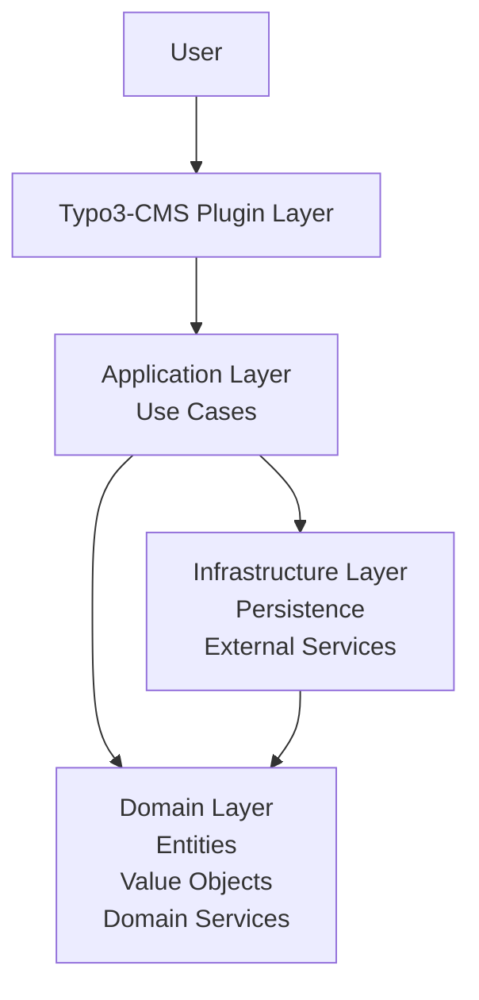

# 👋 Hi, I'm a Software Developer

I am currently completing my apprenticeship as a **Fachinformatiker für Anwendungsentwicklung (Software Developer)** in Germany at **Xsigns**.

With **almost 6 years of programming experience**, I already work on **real-world projects** and focus on building **scalable, maintainable and well-structured software systems**.

My main interest lies in **software architecture and clean code**.

---

# 🧠 Software Architecture

I design applications using modern architectural principles:

* SOLID Principles
* Domain Driven Design (DDD)
* Explicit Architecture
* Clean Architecture

My projects are structured into **clearly separated layers**.

### Layer Responsibilities

**Domain**

* Entities
* Value Objects
* Domain services

**Application**

* Use cases
* Orchestration of domain logic

**Infrastructure**

* Persistence
* External services
* technical implementations

**CMS Plugin Layer**

The plugin layer acts as an **adapter between the CMS and the application core**.

It contains only the required logic for:

* user interaction
* CMS specific integrations
* database communication

This allows the **core system to remain framework independent**.

The CMS layer can be replaced with another adapter, for example:

* TYPO3 Plugin
* WordPress Plugin
* Joomla Plugin
* REST API Adapter

without rewriting the entire application.

---

# 🧹 Coding Philosophy

I intentionally write **self-explanatory code without comments**.

Instead of comments, I focus on:

* clear architecture
* meaningful class and variable names
* single responsibility
* explicit boundaries between layers

This makes the codebase easier to understand and maintain.

---

# ⚙️ Development Workflow

My development environment and workflow includes:

* **Docker** for containerized development environments
* **GitHub** for version control and project management
* **Xdebug** for efficient debugging
* **PHPStan & Psalm** for static analysis and strong typing

All services required for development run in **Docker containers**.

---

# 🎨 Frontend Development

For modern frontend development I use:

* **TypeScript**
* **TailwindCSS**
* **Fluid Template Engine**

My focus is on building **responsive, modern and maintainable interfaces**.

---

# 🛠 Tech Stack

### Backend

* PHP
* TYPO3
* Domain Driven Design
* Clean Architecture

### Frontend

* TypeScript
* TailwindCSS
* Fluid

### Development Tools

* Docker
* Git / GitHub
* Xdebug
* PHPStan
* Psalm

---

# 🎯 Development Focus

I focus on building software that is:

* scalable
* maintainable
* modular
* framework independent

and follows **modern architecture principles**.

---

⭐ Feel free to explore my repositories to see how I structure real projects.
