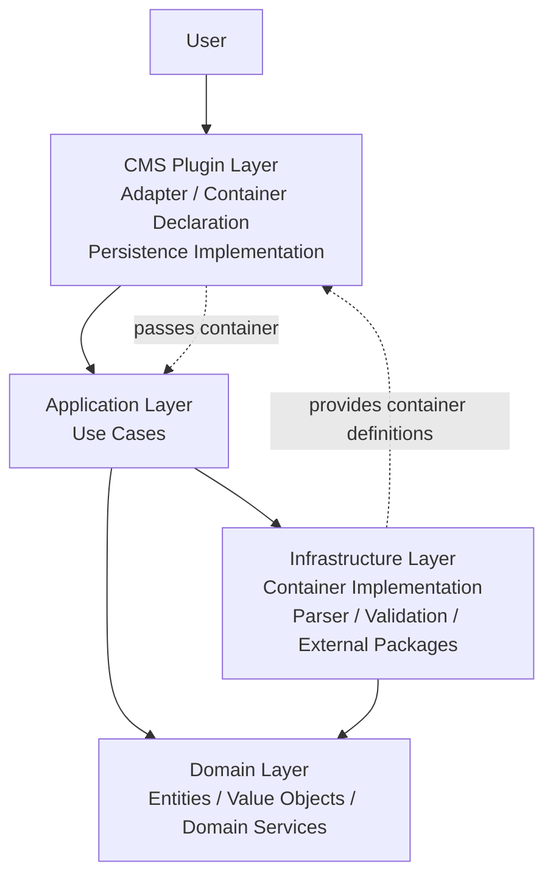

# 👋 Hi, I'm a Software Developer

I am currently completing my apprenticeship as a **IT specialist for Software development** (Fachinformatiker für Anwendungsentwicklung) in Germany at **Xsigns GmbH & Co. KG**.

With **almost 6 years of programming experience**, I develop **scalable, maintainable, and modular web applications**.

I focus on **clean code, modern architecture, testing, and frontend development**.

---

# 🛠 What I Can Do

* Design and implement **modular applications** following **SOLID Principles, DDD, and Explicit Architecture**
* Build **framework-independent application cores**
* Integrate systems via **Dependency Injection**
* Develop **TYPO3-CMS** plugins
* Write **self-explanatory code without comments**
* Ensure reliability with **Unit Tests**, **PHPStan**, and **Psalm**
* Use **Docker** for isolated development environments
* Debug efficiently with **Xdebug**
* Create **modern, responsive frontends** using **TypeScript**, **TailwindCSS**, and **Fluid**

---

# 🏗 Architecture Overview

This diagram shows how I structure projects using **explicit architecture** and **Dependency Injection**:



**Highlights:**

* **Domain:** contains only business logic, independent of frameworks
* **Infrastructure:** implements technical details (parsers, validation, external packages), depends only on Domain
* **Application:** orchestrates Domain logic, uses Infrastructure via **Dependency Injection**
* **CMS Plugin Layer:** builds the **DI container**, integrates CMS with Application core, implements **Persistence**

This allows **swappable adapters** without rewriting the core system.

---

# 🧹 Coding Philosophy

I intentionally write **self-explanatory code without comments**.

Instead of comments, I focus on:

* clear architecture
* meaningful class and variable names
* single responsibility
* explicit boundaries between layers

This makes the codebase easier to understand and maintain.

---

# ⚙️ Development Workflow

My development workflow includes:

* **Docker** for containerized development environments
* **GitHub** for version control and project management
* **Xdebug** for efficient debugging
* **PHPStan & Psalm** for static analysis and strong typing
* **PHPUnit / Unit Tests** for reliability and maintainability

All services required for development run in **Docker containers**.

---

# 🎨 Frontend Development

For modern frontend development I use:

* **TypeScript**
* **TailwindCSS**
* **Fluid Template Engine**

My focus is on building **responsive, modern, and maintainable interfaces**.

---

# 🛠 Tech Stack

### Backend

* PHP
* TYPO3
* Domain Driven Design
* Explicit Architecture
* Clean Architecture

### Frontend

* TypeScript
* TailwindCSS
* Fluid

### Development Tools

* Docker
* Git / GitHub
* Xdebug
* PHPStan / Psalm
* PHPUnit / Unit Testing

---

# 📂 Project Structure

My projects are organized as **modular monorepos** with clear separation:

```id="dltumk"
{project-name}-core/         # Core system (Domain + Application + Infrastructure)
  src/
    Domain/
      Entity/
      ValueObject/
      Service/
    Application/
      UseCase/
      DTO/
      Service/
    Infrastructure/
      Parser/
      Validation/
      External/

{project-name}-typo3-plugin/ # TYPO3 plugin (adapter layer)
  composer.json               # Installs {project-name}-core via Composer
  Plugin/
    Persistence/
    Controllers/
    Configuration/
    Templates/
    ...
```

**Highlights:**

* **Core:** contains all business logic, use cases, and infrastructure services; framework-independent
* **Plugin:** contains **CMS-specific adapter logic** and **Persistence**; declares the DI container, integrates Core services
* Core can be reused in other adapters (e.g., WordPress, Joomla, REST API) **without changing it**

---

# 🎯 Development Focus

I focus on building software that is:

* scalable
* maintainable
* modular
* framework independent

and follows **modern architecture principles**.
